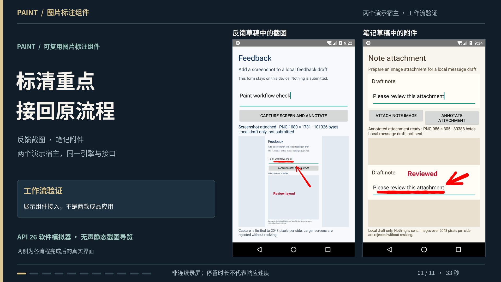

# Oritwig Paint

**Android screenshot and image annotation, extracted from Telegram's Paint core.** Pen, curved stroke arrows, editable text, transforms and undo, behind a small source-module API that returns a flattened image.

One GPL-3.0 source component, with two independently buildable example hosts: a feedback screenshot and a note-image attachment. The hosts demonstrate integration; this is an experimental source module, with no stable SDK compatibility promise.



Video publication is pending. [Actual screenshots and captions](docs/media/README.md) are included.

## Why this exists

Use this when you want to inspect and adapt Telegram's retained pen/pressure/smoothing and curved-arrow behavior for a GPL-compatible Android annotation flow. The useful boundary is caller-owned bitmap → annotation session → source-sized flat result. There are no account, network, native-library or third-party runtime Maven dependencies.

- For a few simple marks, [Android Canvas](https://developer.android.com/develop/ui/views/layout/custom-views/custom-drawing) is a smaller starting point; you own gesture, undo and export behavior.
- For a broader packaged editor, [PhotoEditor](https://github.com/burhanrashid52/PhotoEditor) offers text, shapes, filters, stickers and redo under MIT. Compare its API and license against your needs first.
- Oritwig Paint's reason to exist is this narrow, traceable Telegram extraction and its integration/return contract. No performance advantage, adoption or saved development time has been established.

## What is upstream, and what changed?

Upstream: [DrKLO/Telegram](https://github.com/DrKLO/Telegram/tree/f2908b14133bbffbf7ab04f641ecb5bfaf533242), commit `f2908b14133bbffbf7ab04f641ecb5bfaf533242`. Retained code provides stroke smoothing/pressure/arrow geometry, GL rasterization, compressed undo and plain-text entity layout/transforms. Five shader strings and the single radial brush resource are unchanged.

Oritwig adds the `MarkupSession` boundary, Android-platform adapters, transactional gesture undo/cancel, source-space mapping, commit-aware asynchronous Finish, exact surface snapshots, lifecycle/failure handling, and explicit brush-pass blend state. The two hosts supply image capture, controls, PNG encoding and result consumption. [Per-file provenance and exclusions](provenance/README.md)

## Try or integrate

Requires Android API 26+. Build tooling was verified with JDK 21, Gradle 8.11.1, AGP 8.9.3 and Android SDK 35/build-tools 35.0.0.

```sh
python3 tools/verify-publication.py
./gradlew --no-daemon --max-workers=1 :smoke-host:assembleDebug
(cd standalone-consumer && ./gradlew --no-daemon --max-workers=1 :app:assembleDebug)
```

See [BUILD.md](BUILD.md) for SDK/cache prerequisites and checks, [API.md](API.md) for ownership and callbacks, and the [feedback](smoke-host/README.md) / [attachment](standalone-consumer/README.md) examples. The first Gradle run may download normal build dependencies; no prebuilt app/module binaries or signing keys are included here.

## Evidence and limits

- API 26 synthetic fixture: **272 supported checks passed, 0 failed, 2 unsupported**, with zero-tolerance pixel checks
- Actual OS-input feedback and attachment flows returned callback metadata and visible previews; ordinary PNG byte arrays were not separately extracted
- Inputs: **1–2048 pixels per side**; flattened output only; no redo, editable-project persistence or process recovery
- API 26 pinch and the absent plain-text whole-handle route are unsupported; physical stylus behavior, newer-device coverage and performance remain unproven

[CHECKS.md](CHECKS.md) separates runtime evidence from source-only CI. System fonts can vary between devices.

## License

[GPL-3.0](LICENSE), selected from Telegram's GPL-2.0-or-later grant; retain the accompanying [NOTICE](NOTICE). The radial brush relies on the documented repository-wide grant inference, not a separate per-asset license. Read the [bounded license review](provenance/license-review/REVIEW.md) before distribution or integration. This project is not affiliated with Telegram.
